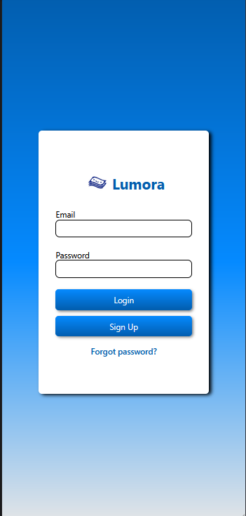
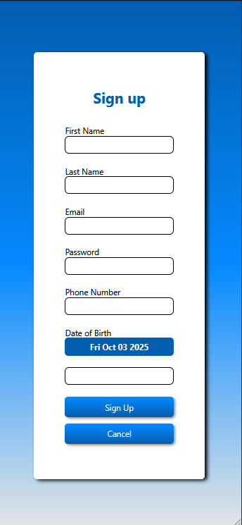
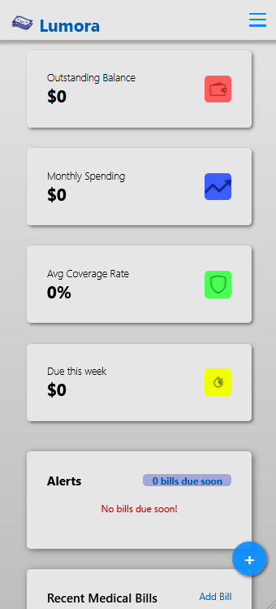
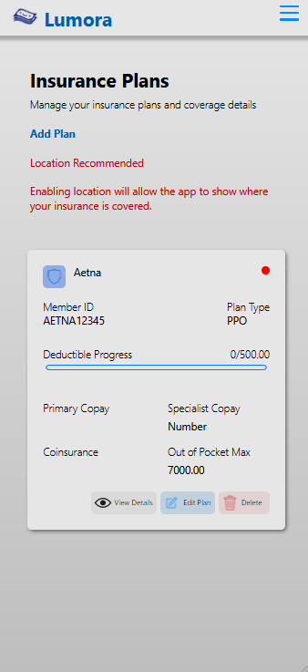
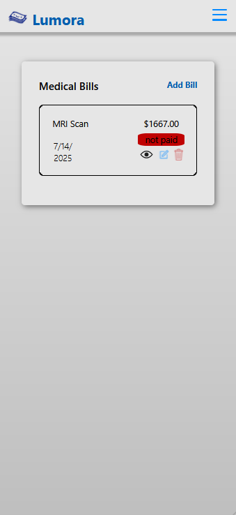

# Lumora - In Development

A comprehensive mobile application for managing insurance plans, tracking bills, and viewing insurance benefits in real-time.

## Overview

This application provides users with a centralized platform to manage their insurance plans, track medical bills, and access detailed information about their insurance benefits. Built with modern technologies and integrated with the STEDI API for real-time insurance benefit data.

## Features

### 📋 Bill Manager
- Track and manage medical bills
- View payment history
- Organize bills by date, provider, and amount
- Set payment reminders

### 🏥 Insurance Plan Manager
- Store multiple insurance plans
- View plan details and coverage information
- Compare plans side-by-side
- Update plan information easily

### ✅ Benefits Viewer
- Real-time insurance benefits lookup via STEDI API
- View coverage details for specific procedures and services
- Check deductibles, copays, and out-of-pocket maximums
- Understand what's covered under your plan

## Technology Stack

### Frontend
- **React Native** - Cross-platform mobile development
- **JavaScript** - Primary programming language for UI logic

### Backend
- **Node.js** - Server-side runtime environment
- **Python** - Backend services and API integration
- **SQL** - Database management for storing user data, bills, and insurance plans

### APIs
- **STEDI API** - Insurance benefit verification and eligibility checking

## Screenshots

## Architecture

The app follows a client-server architecture:

1. **Mobile App (React Native)** - User interface and client-side logic
2. **Backend Services (Node.js & Python)** - Business logic and API handling
3. **Database (SQL)** - Persistent data storage
4. **STEDI API Integration** - External insurance benefit data

## Key Functionalities

- **User Authentication** - Secure login and data protection
- **Data Synchronization** - Real-time updates across devices
- **Benefit Verification** - Instant insurance coverage checks
- **Bill Tracking** - Comprehensive bill management system
- **Multi-Plan Support** - Manage multiple insurance plans in one place

## Security & Privacy

- Encrypted data storage
- Secure API communications
- HIPAA-compliant data handling practices
- User authentication and authorization

## Future Enhancements

- Push notifications for bill due dates
- Document scanning and OCR for bill uploads
- Integration with healthcare provider systems
- Claims submission and tracking
- Health savings account (HSA) integration

**Note:** This is a demonstration project showcasing full-stack mobile development capabilities with real-world API integration.
